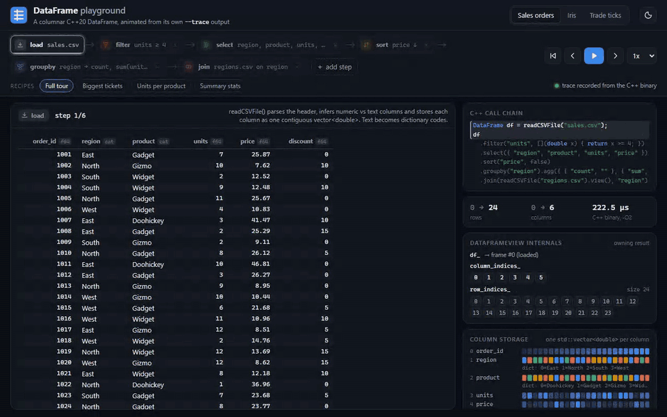
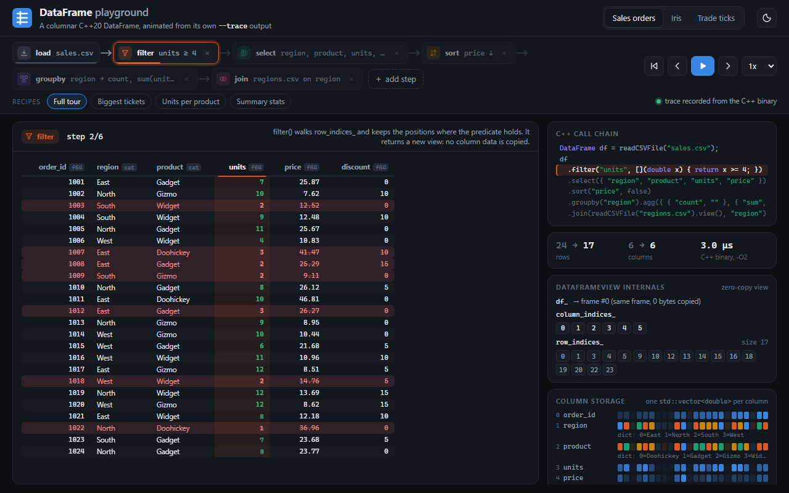
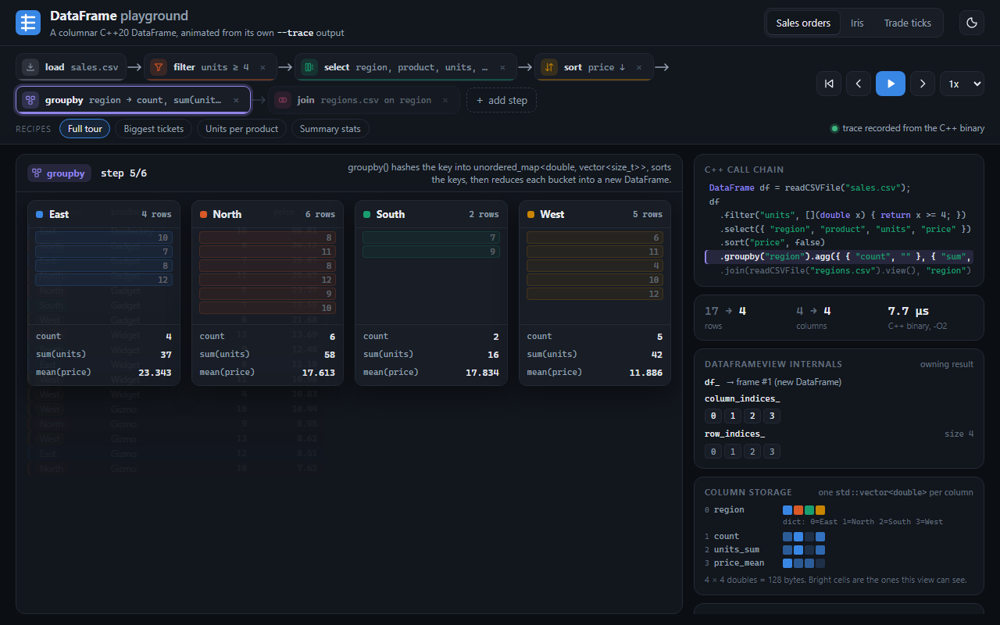
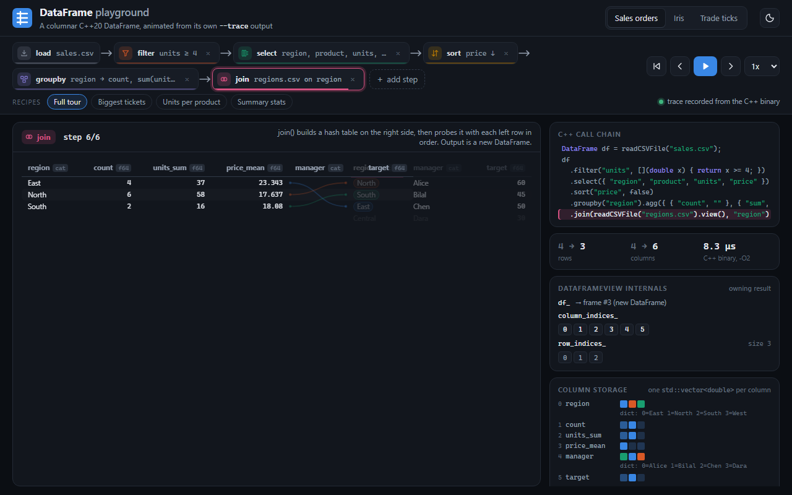
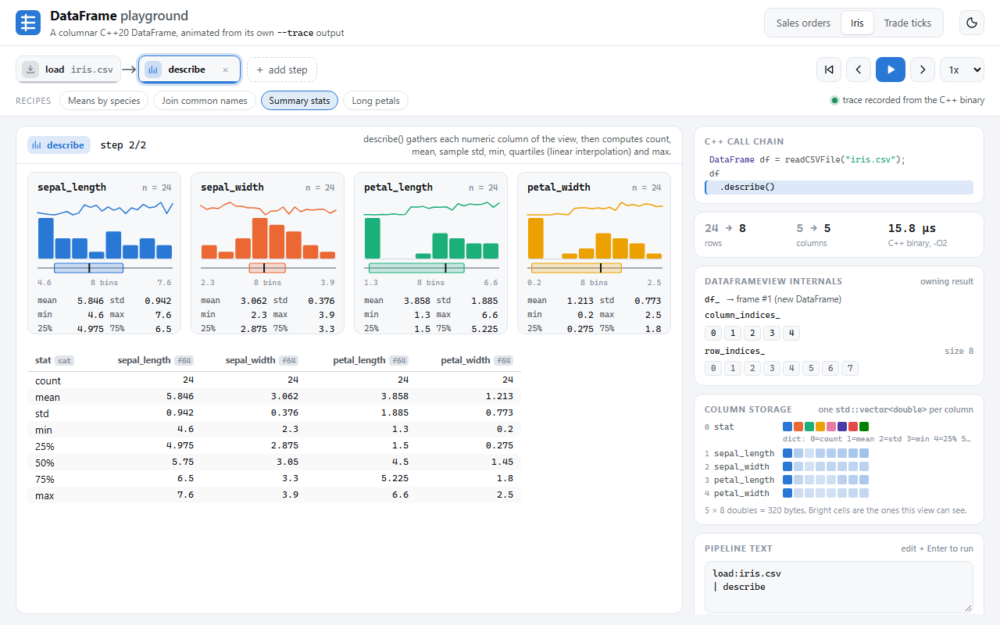
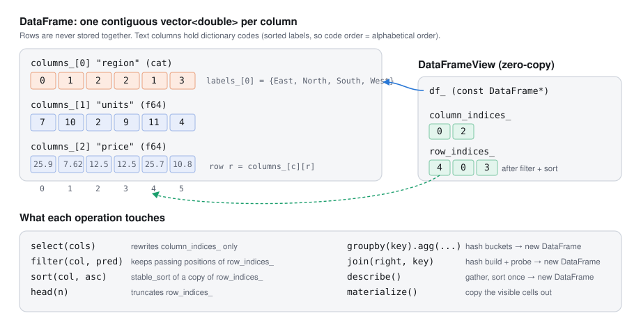
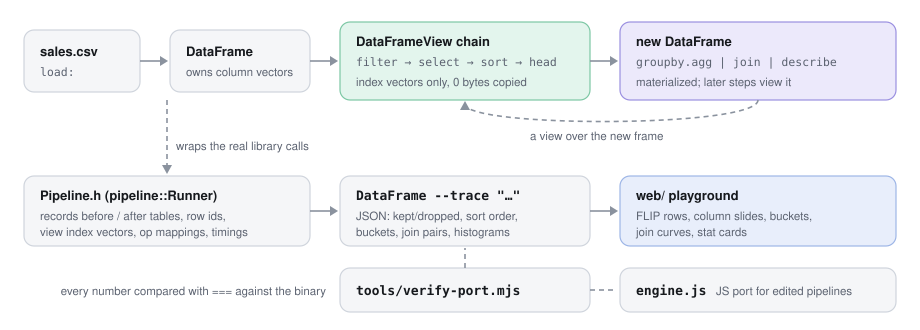

# DataFrame

A small pandas-style DataFrame library in C++20: columnar storage, zero-copy views, group-by, hash join and `describe()`, plus a browser playground that animates what each operation does, driven by traces from the real binary.



The full recording, including editing a step and the `describe()` cards, is in [`docs/media/demo.mp4`](docs/media/demo.mp4).

## What it does

- **Columnar storage.** A `DataFrame` owns one `std::vector<double>` per column. Text columns are dictionary-encoded: the cells hold codes, the column keeps a sorted label list.
- **Zero-copy views.** `select`, `filter`, `sort` and `head` return a `DataFrameView`, which is a pointer to the frame plus a column-index vector and a row-index vector. No cell is copied.
- **Group-by and aggregation.** `groupby(key)` buckets rows through a hash map, sorts the keys (like pandas' `sort=True`) and reduces each bucket with `count`, `sum`, `mean`, `min` or `max` into a new `DataFrame`.
- **Inner hash join.** `join(right, key)` builds a hash table on the right side and probes it with each left row in order. Categorical keys match by label, so two files with different dictionaries still join correctly.
- **`describe()`.** count, mean, sample std, min, quartiles (linear interpolation, same as pandas) and max for every numeric column.
- **CSV loading** with type inference: a column where every cell parses as a number is numeric, anything else becomes categorical.
- **`--trace` mode.** The CLI runs a text pipeline and prints a JSON trace: before/after tables, stable row ids, the view's index vectors, and a per-operation mapping (kept/dropped rows, sort order, group buckets, join pairs, histograms). The web playground animates exactly that.

```cpp
DataFrame sales = readCSVFile("web/data/sales.csv");
DataFrame regions = readCSVFile("web/data/regions.csv");

DataFrame summary = sales.view()
    .filter("units", [](double x) { return x >= 4; })
    .select({ "region", "units", "price" })
    .groupby("region")
    .agg({ { "count", "" }, { "sum", "units" }, { "mean", "price" } });

DataFrame result = summary.view().join(regions.view(), "region");
std::cout << result;
```

## The playground

`web/` is a static page (plain HTML, CSS and ES modules, no build step). Pick a dataset and a recipe, press play, and every step animates:

| Operation | What you see |
| --- | --- |
| load | columns drop in, the storage panel fills one vector per column |
| filter | the predicate column is scanned row by row, failing rows turn red and collapse, survivors slide up |
| select | dropped columns fold away, kept columns slide into their new order |
| sort | rows reorder with FLIP transitions; the `row_indices_` chips reorder the same way |
| head | a cut line is drawn, rows below it fall away |
| groupby | rows are tinted by key, fly into buckets as tokens, the aggregates count up, buckets collapse into result rows |
| join | the right table slides in, a curve connects every matching key pair, unmatched rows dim, then both sides merge |
| describe | one card per column with a histogram, a sparkline of the values and a box plot, above the `describe()` table |

The right-hand panel shows the equivalent C++ call chain, rows/columns in and out with the time measured by the binary, the `DataFrameView` internals (`df_`, `column_indices_`, `row_indices_`) and the physical column storage, with the cells the current view can see highlighted.

The pipeline chips are editable. Double-click a chip to change its arguments, use `+ add step` to append one, or edit the pipeline text directly. Recipes play traces recorded from the C++ binary. An edited pipeline runs through `web/engine.js`, a JavaScript port of the same code. `tools/verify-port.mjs` runs all 12 recipes, 17 extra pipelines and 7 failing ones through both and checks that the traces are identical, comparing every number with `===` (only timings are ignored). The badge under the transport controls says which engine produced the trace on screen.

| | |
| --- | --- |
|  |  |
|  |  |

## How it works



A view never owns data. `filter` builds a new row-index vector, `sort` stable-sorts a copy of it, `select` rewrites the column-index vector. Operations that produce new values (group-by, join, describe) materialize a new `DataFrame`, and the next step gets a view over that.



`Pipeline.h` parses a pipeline string, calls the normal library API for each step and records what happened. Row ids have the form `<frame>:<row>`, so the visualizer can key DOM elements by id and animate a row from its old position to its new one. The frame number changes whenever an operation materializes a new `DataFrame`.

Pipeline syntax (steps separated by `|`):

```
load:<file.csv>
filter:<column><op><value>        op: >= <= > < == !=   (== and != only on text columns)
select:<col>,<col>,...
sort:<column>[:desc]
head:<n>
groupby:<key>:<agg>,<agg>,...     agg: count | sum(col) | mean(col) | min(col) | max(col)
join:<file.csv>:<key>
describe
```

## Quick start

Requirements: a C++20 compiler (tested with g++ 15.2 from MSYS2 UCRT64; the Visual Studio project is kept), and Node 18+ for the trace tools.

Build, test and regenerate the playground traces in one go:

```sh
./build.sh
```

That compiles `build/DataFrame` and `build/dataframe_tests` with g++, runs the tests (98 checks), writes `web/traces/*.json` from the binary and runs the JS port check. With CMake and a generator such as Ninja or Make:

```sh
cmake -S . -B build -G Ninja
cmake --build build
ctest --test-dir build --output-on-failure
```

Visual Studio users can still open `DataFrame.slnx`. The new code lives in files that project already compiles, plus the header-only `Pipeline.h`.

Run things:

```sh
./build/DataFrame                      # 1M-row benchmark (the original main)
./build/DataFrame --run   "load:sales.csv | filter:units>=4 | groupby:region:count,mean(price) | join:regions.csv:region" --data-dir web/data
./build/DataFrame --trace "load:iris.csv | describe" --data-dir web/data -o trace.json
node tools/gen-traces.mjs              # rebuild web/traces from web/recipes.json
node tools/verify-port.mjs             # compare engine.js against the binary
```

Open the playground:

```sh
cd web && python -m http.server 8116   # then visit http://localhost:8116
```

URL parameters: `?dataset=iris&recipe=iris-join`, `?autoplay=0`, `?theme=light`. Keyboard: Space plays or pauses, the arrow keys step, Home restarts.

### Deploying the playground

It is a static site. On Vercel: root directory `web`, framework preset "Other", no build command, output directory `.` (the default), no environment variables.

## Benchmark

`./build/DataFrame` with no arguments builds a 1,000,000-row frame (`price`, `volume`, `signal`) and times each operation. g++ 15.2 `-O2`, one run on a desktop machine:

| Operation | Time |
| --- | --- |
| select() | 1.6 ms |
| select + head(1000) | 2.2 ms |
| select + filter() | 7.8 ms |
| select + sort() | 86 ms |
| groupby + count() | 16.7 ms |
| groupby + mean() | 18.4 ms |
| describe() | 123 ms |
| select + filter + groupby + mean() | 18.4 ms |

`select` is not free even though it copies no cells: it allocates the full row-index vector (8 MB for 1M rows).

## Project layout

```
Column.h              one column: vector<double> plus sum/mean/min/max/std/quantiles/median
DataFrame.h/.cpp      owning frame: names, columns, categorical dictionaries
DataFrameView.h/.cpp  zero-copy view: select, filter, sort, head, join, describe, materialize
GroupedDataFrame.h    hash buckets and aggregations (count, sum, mean, min, max, agg)
CsvReader.h/.cpp      CSV parsing with numeric/categorical inference
ColumnIO.h            operator<< for Column, DataFrame and DataFrameView
Benchmark.h           timer and the synthetic 1M-row frame
Pipeline.h            pipeline parser, runner and JSON trace writer
main.cpp              CLI: benchmark, --run, --trace
tests/                self-contained test runner (no framework)
tools/                gen-traces.mjs, verify-port.mjs
web/                  playground: index.html, style.css, app.js, engine.js, data/, traces/, recipes.json
docs/media/           demo recording, screenshots, diagrams
CMakeLists.txt, build.sh, DataFrame.slnx / .vcxproj
```

## Design notes and trade-offs

- **Everything is a double.** One storage type keeps `Column` trivial and the hot loops branch-free. Text pays with a dictionary lookup when printing, and comparisons on text columns are limited to `==` and `!=`.
- **Sorted dictionaries.** The CSV loader sorts each dictionary, so sorting or grouping by the code gives alphabetical order for free. Dictionaries built elsewhere (the `stat` column of `describe()`) keep insertion order instead.
- **Views hold a raw pointer.** A view must not outlive its frame, and moving a `DataFrame` invalidates views into it. `Pipeline.h` keeps frames in a `std::deque` so their addresses stay stable. Ownership through `shared_ptr` would remove the footgun at the cost of refcounting on every view.
- **Deterministic group-by.** Buckets are built with `unordered_map<double, ...>` and then the keys are sorted. The original code emitted groups in hash order, which can differ between standard libraries.
- **Join keys by label.** Categorical keys are compared as strings so frames with different dictionaries join correctly. Numeric keys are compared by their exact 17-digit representation.
- **Row ids for animation.** The trace identifies rows as `<frame>:<row>` instead of by position, which is what makes FLIP animation of filters and sorts possible.
- **The JS port.** It exists only so edited pipelines work in a static page. Its CSV number check is a simple decimal regex while the C++ side uses `std::stod`, so unusual inputs (hex, `inf`) could differ. The shipped data is covered by the verification script.

## Fixes in this pass

`readCSVString` threw on any text cell, and both CSV readers kept the `\r` of CRLF files. Group-by output order depended on the hash map. `min()`, `max()` and `median()` on an empty column were undefined behaviour. Duplicate column names silently shadowed each other. MinGW builds now link the runtime statically: Git for Windows puts its own `libstdc++-6.dll` on PATH, and with that DLL loaded, exceptions crashed the `-O2` build.

## License

Open source, free to use and modify.
